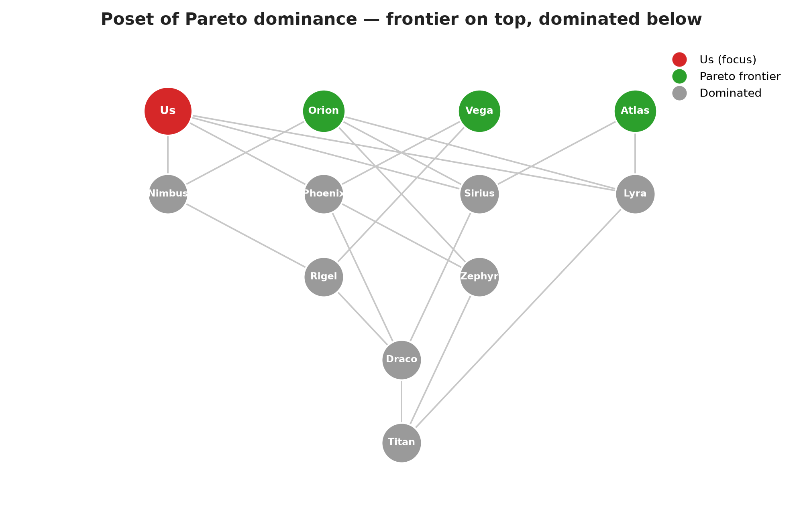
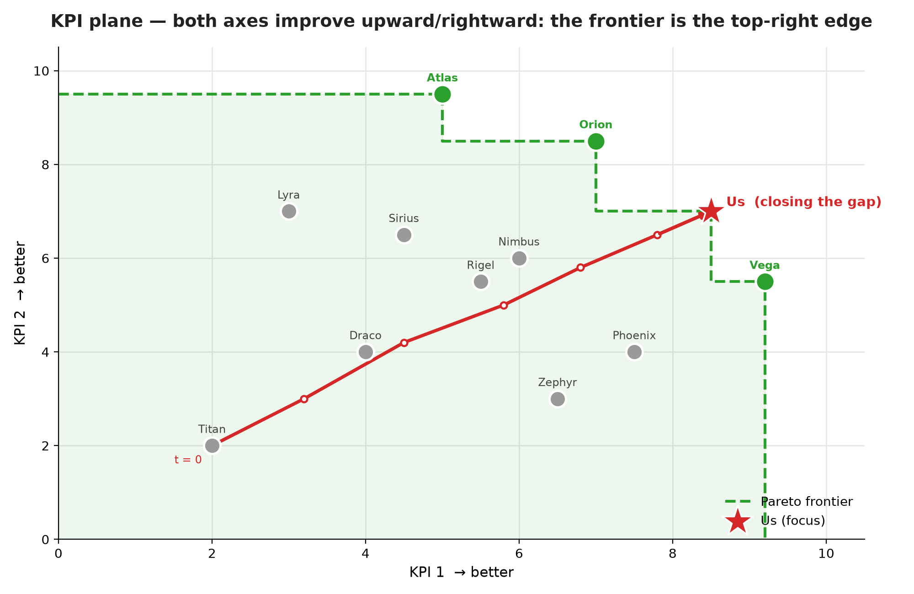

  

# Nadir

**Nadir** is a Decision Support System (DSS) designed to solve multi-period trajectory kpi optimization problems. By mapping performance profiles using **Partially Ordered Sets (Posets)** and leveraging **counterfactual simulation**, Nadir helps analysts and systems answer a core strategic question: 

> *"If we control the levers of specific KPIs, how should we schedule investments over time to beat competitors or reach the Pareto efficient frontier at the lowest possible cost?"*

Unlike traditional static benchmarking tools, Nadir acts as a **Geometric Model Predictive Control (MPC)** engine, evaluating cumulative state transitions and dynamic resource allocations across a discrete-time horizon ($t = 1 \dots T$).

---

## � Applications

Nadir is domain-agnostic: it can be applied to any wide range of scenarios where a set of subjects is compared across quantitative KPIs and some form of **competition** exists between them — whichever the nature of the subjects and the KPIs at play. Examples include stocks and other financial instruments, race cars or athletes in a competitive series, companies benchmarked on business metrics, or countries compared on socio-economic indicators.

---

## �🎯 Project Scope

This repository has a dual purpose:
1. **A ready-to-use engine** for simple, self-contained decision-support applications — computing Pareto frontiers, cost-optimal investment trajectories, and counterfactual simulations directly from tabular KPI data.
2. **A theoretical exercise**, exploring geometric and order-theoretic modeling as a foundation that other, more advanced decision-support products can build upon.

Ideas that go beyond this scope are tracked separately in [Future Developments](docs/docs/Future%20Developments.md) rather than implemented here.

---

## 🚀 Key Architectural Pillars
* **Poset-Based Dominance:** Subjects are evaluated across $n$-dimensional quantitative KPIs. The system builds transitively reduced Hasse diagrams to isolate Pareto-optimal maximal elements.
* **Multi-Period State Variables:** Differentiates between cumulative state variables (KPI levels) and per-period flow variables (investment costs) to model continuous progress without repetitive maintenance penalties.
* **Custom Cost Curves:** Supports user-defined smooth quadratic ($\alpha u^2$) and asymmetric non-smooth cost functions to simulate diminishing marginal returns and realistic asset decay.
* **Mathematical Optimization:** Formulates target-tracking or frontier-entry trajectories through non-linear mathematical programming (including MILP/MINLP formulations for disjunctive Pareto constraints).

---

## �️ Two Views of the Same Problem

Nadir looks at the same subjects through two complementary lenses: an **order-theoretic** view (who dominates whom) and a **geometric** one (where everyone sits on the KPI plane). Both are automatically derived from the same subject data.

  

  

In this toy example, `Atlas`, `Orion`, `Vega` and `Us` sit on the **Pareto frontier** — none of them is beaten on *both* KPIs at once — while everyone else is dominated by at least one of them. The red trajectory shows `Us` closing the gap to the frontier period by period, exactly the kind of counterfactual path Nadir is built to plan and cost.

---

## �🛠️ Tech Stack
* **Optimization & Modeling:** Python (SciPy, Pyomo, IPOPT)
* **Data & Graph Structures:** NetworkX, Polars / Pandas