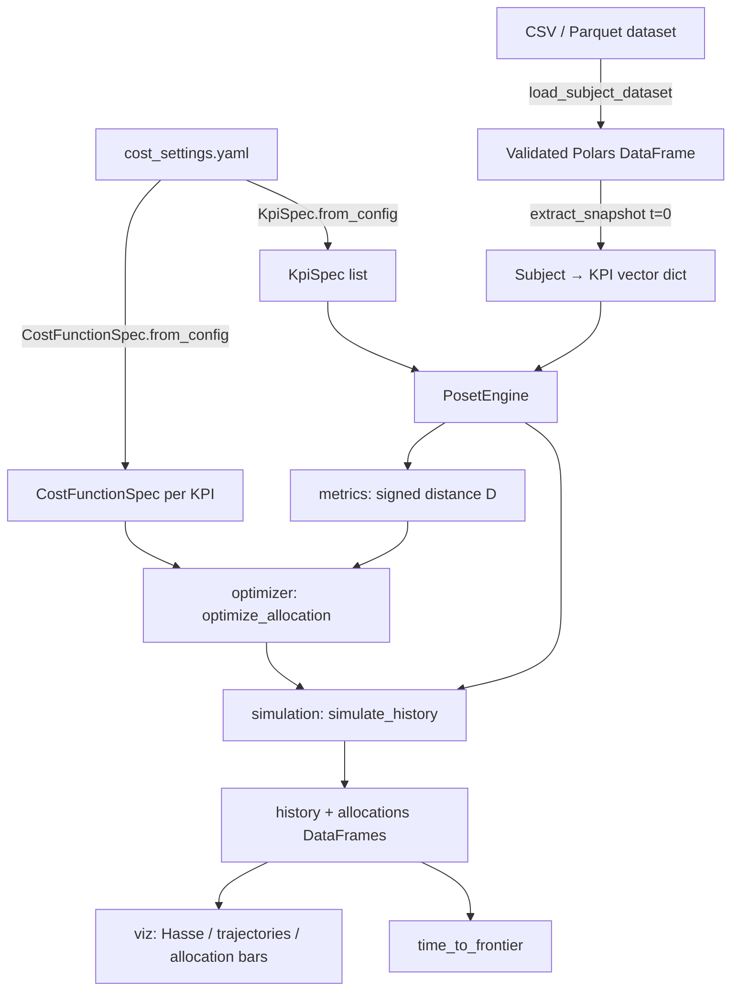

# Architecture

## Repository layout

```
Nadir/
├── config/
│   └── cost_settings.yaml      # simulation settings + per-KPI definitions → [[Configuration]]
├── core/                       # the engine → [[Core Modules]]
│   ├── poset.py                # KpiSpec, PosetEngine (dominance, Hasse, drift)
│   ├── dataset.py              # CSV/Parquet ingestion & validation → [[Data Format]]
│   ├── cost_functions.py       # CostFunctionSpec + registry
│   ├── metrics.py              # signed distance D(s)
│   ├── optimizer.py            # greedy simplex-grid allocator
│   ├── simulation.py           # multi-period counterfactual runner
│   └── viz.py                  # Plotly figures
├── data/
│   └── example_subjects.csv    # toy dataset (Us + 3 competitors)
├── notebooks/                  # marimo notebooks (see [[Recipes#Run a marimo notebook]])
│   ├── master_notebook.py
│   ├── phase1_sandbox.py
│   └── cost_functions_sandbox.py
├── tests/                      # pytest suite
└── docs/
    ├── agents/                 # design docs for AI agents
    └── docs/                   # ← this vault
```

## Data flow



## Layering rules

- `poset.py` is the foundation: no imports from other core modules.
- `dataset.py`, `metrics.py`, `cost_functions.py` depend only on `poset.py` (specs/orientation).
- `optimizer.py` composes metrics + cost functions; `simulation.py` composes everything; `viz.py` is a pure consumer.
- Notebooks and tests sit on top and never get imported by `core/`.

See [[Future Developments]] for an open modeling question (KPIs in opposition to each other) not yet addressed by this layout.
